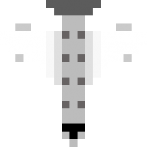
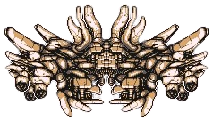
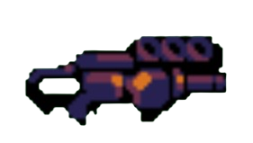
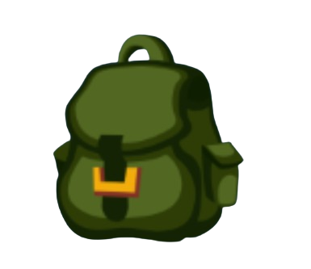
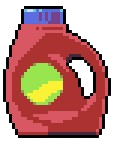

---

# 🎮 슈팅 게임 v1.0 - 플레이 가이드 & 패치노트

## 📋 게임 소개
하늘을 지키는 슈팅 게임! 적들을 물리치고 최고 점수에 도전하세요.

---

## 🕹️ 기본 조작법
- **방향키 (↑↓←→)**: 비행기 이동
- **스페이스바**: 총알 발사
- **R**: 게임 재시작 (게임오버 시)
- **Q**: 게임 종료 (게임오버 시)
- **ESC**: 이전 화면으로 (메뉴에서)

---

## ✈️ 플레이어 정보


### 기본 능력
- **생명력**: 하트 3개 (우측 상단에 표시)
- **기본 탄약**: 10발 (자동 재장전)
- **무적 시간**: 피격 시 2초간 무적 (깜빡임 효과)
- **이동 속도**: 기본 5

### 탄약 시스템
- 1초마다 탄약 1발 자동 재장전
- 연속 발사 가능 (0.2초 쿨타임)
- 화면 좌측에 현재 탄약 표시

---

## 👾 적 & 장애물

### 일반 적 (Enemy)



- **체력**: 3
- **점수**: 처치 시 50점
- **특징**: 위에서 아래로 천천히 내려옴
- **충돌**: 플레이어와 부딪히면 하트 1개 감소

### 💰 코인 (Coin)


- **점수**: 획득 시 10점
- **특징**: 떨어지는 코인을 먹어서 점수 획득

---

## 🦖 보스 시스템

### 첫 번째 보스 (25초 후 등장)


- **등장 시간**: 생존 25초 후
- **경고**: 화면 중앙에 경고 표시 후 2초 뒤 등장
- **체력**: 30
- **패턴**: 일정 간격으로 총알 발사
- **보상**: 처치 시 300점

### 이동형 보스 (이후 계속 등장)


- **등장 주기**: 이전 보스 처치 후 20초마다
- **체력**: 30 + (처치 횟수 × 20) (계속 강해짐)
- **패턴**: 
  - 좌우로 이동하며 공격
  - 공격 속도가 점점 빨라짐 (최소 0.4초)
  - 최종 단계: 일직선 탄막 발사 (9~12초마다)
 

  
- **특징**: 최종 보스는 다른 이미지 사용

### 보스 총알 (BossBullet)


- **충돌**: 플레이어와 부딪히면 하트 1개 감소
- **특징**: 보스보다 빠르게 아래로 이동

---

## 🎁 아이템 시스템

### 🔫 총알 아이템 (BulletItem)


- **효과**: 탄약 +5 즉시 충전
- **등장 확률**: 약 0.25%
- **이미지**: bulletItem.png

### 🔫 총 업그레이드 (GunItem)



- **효과**: 총 레벨 업 (최대 Lv.3)
  - Lv.1: 1발 발사 (중앙)
  - Lv.2: 2발 발사 (좌우)
  - Lv.3: 3발 발사 (중앙, 좌, 우)
- **등장 확률**: 약 0.05% (최대 레벨 달성 시 미출현)
- **이미지**: gunItem.png

### 🎒 가방 업그레이드 (BagItem)



- **효과**: 가방 레벨 업 (최대 Lv.3)
  - Lv.1: 최대 탄약 10발, 재장전 1.0초
  - Lv.2: 최대 탄약 13발, 재장전 0.8초
  - Lv.3: 최대 탄약 16발, 재장전 0.6초
- **등장 확률**: 약 0.05% (최대 레벨 달성 시 미출현)
- **특징**: 획득 시 탄약 즉시 만충전
- **이미지**: bagItem.png

### 🚀 속도 증가 (SpeedItem)



- **효과**: 이동 속도 1.5배 (4초간)
- **등장 확률**: 약 0.1%
- **이미지**: speedItem.png

---

## 🎯 게임 시스템

### 점수 획득
- 일반 적 처치: **50점**
- 보스 공격: **10점** (피격당할 때마다)
- 보스 처치: **300점**
- 코인 획득: **10점**

### 난이도 증가
- 시간이 지날수록 보스가 강해짐
- 보스 체력: 30 → 50 → 70 → 90...
- 보스 공격 속도: 1.0초 → 0.8초 → 0.6초 → 0.4초 (최소)

### 게임오버 조건
- 하트가 모두 소진되었을 때
- 피격 시 2초 무적 시간 부여로 연속 피격 방지

---

## 🏆 랭킹 시스템

### 점수 등록
1. 게임오버 시 **"1. Register Score"** 클릭 또는 **1번 키**
2. 닉네임 입력 (최대 10자, 영문/숫자/_ / -)
3. **Enter**로 저장, **ESC**로 취소

### 랭킹 확인
1. 게임오버 시 **"2. View Rankings"** 클릭 또는 **2번 키**
2. 상위 10명 랭킹 확인
3. 1~3위는 금/은/동 색상으로 표시

---

## 💡 플레이 팁
1. **초반**: 코인을 모으면서 아이템 수집에 집중
2. **총 업그레이드**: 우선적으로 획득 (화력 증가)
3. **가방 업그레이드**: 지속적인 화력 유지에 필수
4. **보스전**: 좌우 이동으로 총알 회피, 꾸준히 공격
5. **무적 시간 활용**: 피격 후 2초간 안전하게 위치 선정
6. **속도 아이템**: 보스전이나 위급 상황에서 유용

---

## 🔧 서버 연결 (개발자용)
```python
# 본인 컴퓨터에서 테스트
SERVER_URL = "http://localhost:5000"

# 친구들에게 배포 시
SERVER_URL = "http://192.168.9.4:5000"  # 본인 로컬 IP로 변경
```

---

## 📦 실행 방법
1. Python 3.x 설치
2. 필요한 라이브러리 설치:
   ```bash
   pip install -r requirements.txt
   ```
3. 게임 실행:
   ```bash
   python main.py
   ```

---

## 🎨 게임 에셋 목록
- `player.png` - 플레이어 비행기
- `enemy.png` - 일반 적
- `boss.png` - 첫 번째 보스
- `MovingBoss.png` - 이동형 보스
- `finalBoss.png` - 최종 단계 보스
- `coin.png` - 코인
- `bullet.png` - 플레이어 총알
- `bossBullet.png` - 보스 총알
- `bulletItem.png` - 탄약 아이템
- `gunItem.png` - 총 업그레이드
- `bagItem.png` - 가방 업그레이드
- `speedItem.png` - 속도 증가
- `explosion.png` - 폭발 효과
- `warning.png` - 보스 경고
- `heart_on.png` - 생명력 (활성)
- `heart_off.png` - 생명력 (비활성)
- `background.png` - 배경 이미지

---

**즐거운 플레이 되세요! 🎮✨**

